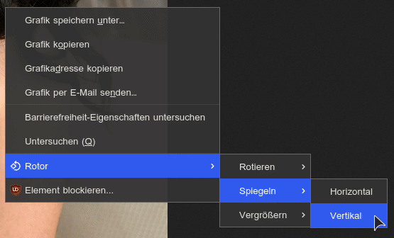

# rotor
Firefox extension for manipulating image positioning.   
With this extension you can rotate, zoom, flip etc. images.

Install rotor comfortably via the offical
[Firefox Addons Page](https://addons.mozilla.org/de/firefox/addon/rotor/).

## Usage

rotor gives you a context menu for images aswell as a little icon in the address bar for rotating the current image loaded by the given URL.

### Examples

**Address bar icon**    

**Context Menu**    

## Languages

Currently supported languages:

- English
- German
